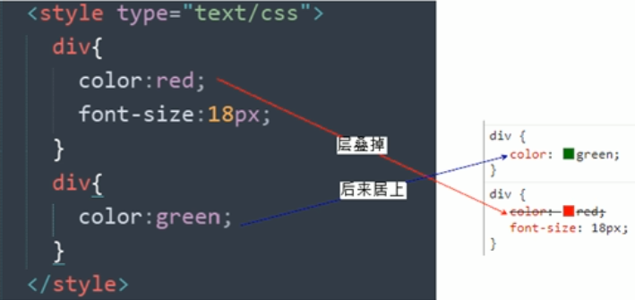
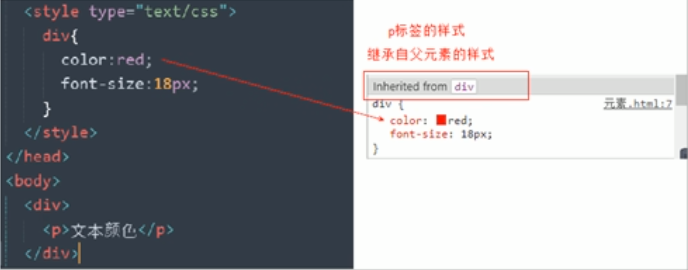

# CSS三大特性

层叠性、继承性、优先级

### 1、层叠性

* 相同选择器设置相同的样式，此时一个样式就会**覆盖**另一个冲突的样式。
* 层叠性主要解决样式冲突的问题
* 层叠性原则：
    * 样式冲突，遵循的原则是**就近原则**



### 2、继承性

* CSS中的继承：子标签会继承父标签里面的某些样式
* 如**文本颜色和字号**等



#### 行高的继承

> `12px/1.5`：让里面所有的子元素的行高是当前文字大小的1.5倍 => 即根据自己文字大小自动调整行高

```
body {
    color: pink;
    /* font: 12px/24px 'Microsoft YaHei'; */
    font: 12px/1.5 'Microsoft YaHei';
}
div {
    /* 子元素继承了父元素 body 的行高 1.5 */
    /* 这个1.5 就是当前元素文字大小 font-size 的1.5倍   所以当前div 的行高就是21像素 */
    font-size: 14px; 
}
p {
    /* 1.5 * 16 =  24 当前的行高 */
    font-size: 16px;
}
/* li 没有手动指定文字大小  则会继承父亲的 文字大小  body 12px 所以 li 的文字大小为 12px 
      当前li 的行高就是  12 * 1.5  =  18
*/
```

```
<body>
    <div>粉红色的回忆</div>
    <p>粉红色的回忆</p>
    <ul>
        <li>我没有指定文字大小</li>
    </ul>
</body>
```

### 3、优先级

– 当同一个元素指定多个选择器，就会有优先级的产生

* 选择器相同，则执行**层叠性**
* 选择器不同，则按**权重**

> tips: 下面的从上往下 优先级越来越高...

| 选择器              | 权重      |
|------------------|---------|
| 继承或者 *           | 0，0，0，0 |
| 元素选择器（标签选择器）     | 0，0，0，1 |
| 类选择器，伪类选择器       | 0，0，1，0 |
| ID选择器            | 0，1，0，0 |
| 行内样式 style=""    | 1，0，0，0 |
| `!important` 重要的 | 无穷大     |

```
<style>	
  .test {
    color: red;
  }
  div {
    color: pink!important;
  }
  #demo {
    color: green;
  }
</style>

<body>
  <div class="test" id="demo" style="color: purple">你笑起来真好看</div>
</body>
```

#### 优先级注意点

* 等级判断是从左到右，如果某一位数值相同，则判断下一位数值
* **继承的权重是0**
* 权重可以叠加，**但是永远不会有进位**

---

### 权重的叠加

* 权重叠加：如果是复合选择器，则会有权重的叠加，需要计算权重

```
<style>
   /* 复合选择器会有权重叠加的问题 */
   /* 权重虽然会叠加,但是永远不会有进位 */
   /* ul li 权重  0,0,0,1 + 0,0,0,1  =  0,0,0,2     2 */
    ul li {
        color: green;
    }
    /* li 的权重是 0,0,0,1    1 */
    li {
        color: red;
    }
    /* .nav li  权重    0,0,1,0  +  0,0,0,1  =  0,0,1,1    11 */
    .nav li {
        color: pink;
    }
</style>
    
<body>
    <ul class="nav">
        <li>大猪蹄子</li>
        <li>大肘子</li>
        <li>猪尾巴</li>
    </ul>
</body>
```
