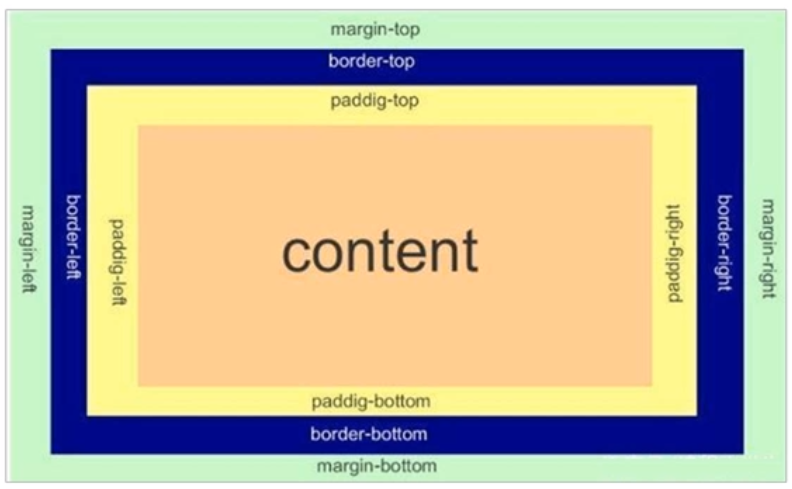
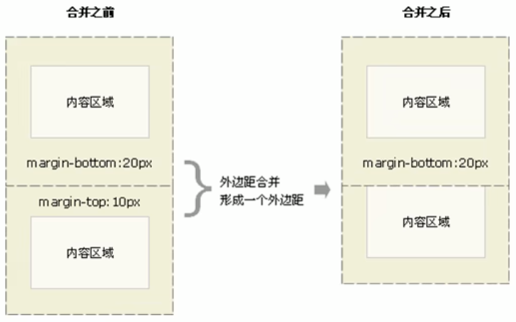
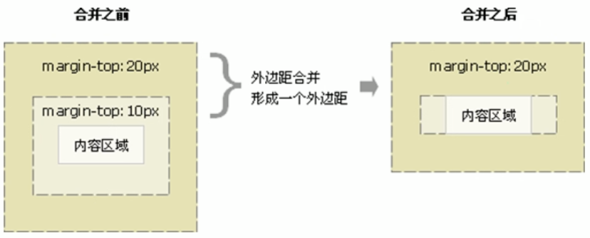

# 盒子模型

页面布局要学习三大核心

* `盒子模型`
* `浮动`
* `定位`

盒子模型的组成：

* `border(边框)`
* `content(内容)`
* `padding(内边距)`
* `margin(外边距)`



### 1、边框border

* CSS 边框属性允许你指定一个元素边框的样式和颜色

* 边框由三部分组成：`边框宽度（粗细） 边框样式 边框颜色`

```
border : borde-width || border-style || border-color
```

| 属性           | 作用           |
|--------------|--------------|
| border-width | 定义边框粗细，单位是px |
| border-style | 边框的样式        |
| border-color | 边框颜色         |

#### 1.1、border-style

边框样式 border-style可以设置如下值：

1. `none`:没有边框即忽略所有边框的宽度（默认值）
2. `solid` :边框为单实线（最为常用的）
3. `dashed`: 边框为虚线
4. `dotted`: 边框为点线

边框简写：没有顺序

```
border : 1px soilid red;
```

边框分开写法：

```
/*只设定上边框，其余同理*/
border-top: 1px solid red;
```

#### 1.2、border-collapse

* border-collapse 属性控制浏览器绘制表格边框的方式，它控制相邻单元格的边框
* `border-coppapse` 表格的细线边框

> tips: 放div中设置无效，好像只有表格中才有效

```
border-collapse : collapse;
```

* 表示相邻边框合并在一起
* collapse 单词是合并的意思

#### 1.3、边框会影响盒子实际大小

边框会额外增加盒子的实际大小，解决方案：

1. 测量盒子大小的时候，不量边框
2. 如果测量的时候包含了边框，则需要 width/height 减去边框宽度
3. css设置 `box-sizing: border-box;` padding和border的值就不会在影响元素的宽高，相当于把padding和border的值都算在content里

### 2、内边距padding

padding 属性用于设置`内边距`,`即盒子边框与内容之间的距离`

| 属性             | 作用   |
|----------------|------|
| padding-left   | 左内边距 |
| padding-right  | 右内边距 |
| padding-top    | 上内边距 |
| padding-bottom | 下内边距 |

* padding属性(简写属性)可以有一到四个值

| 值的个数                        | 表达意思                              |
|-----------------------------|-----------------------------------|
| padding: 5px;               | 1个值，代表`上下左右`都有5像素内边距              |
| padding: 5px 10px;          | 2个值，代表上下内边距是5像素，左右内边距是10像素        |
| padding: 5px 10px 20px;     | 3个值，代表上内边距5像素，左右内边距10像素，下内边距20像素  |
| padding: 5px 10px 20px 30px | 4个值，上是5像素，右是10像素，下20像素，左是30像素，顺时针 |

以上四种情况，我们实际开发都会遇到。

#### 2.1、影响盒子大小

> padding会影响盒子大小的情况

当我们给盒子指定 padding 值之后，发生了2件事情：

1. 内容和边框有了距离，添加了内边距
2. padding影响了盒子实际大小
   `也就是说，如果盒子已经有了宽度和高度，此时再指定内边框，会撑大盒子`

解决方案： 如果保证盒子跟效果图大小保持一致，则让 width/height 减去多出来的内边距大小即可

但是，有时候 padding 影响盒子是有好处的，比如我们要做导航：


因为每个导航栏里面的字数不一样多,我们可以不用给每个盒子宽度了,直接给 padding 最合适.

#### 2.2、不影响盒子大小

> padding不会影响盒子大小的情况

`如果盒子本身没有指定width/height属性，则此时padding不会撑开盒子大小`

### 3、外边距margin

`margin`（外边距）属性用于设置外边距，即控制`盒子和盒子`之间的距离

| 属性            | 作用   |
|---------------|------|
| margin-left   | 左外边距 |
| margin-right  | 右外边距 |
| margin-top    | 上外边距 |
| margin-bottom | 下外边距 |

margin 简写方式代表的意义跟 padding 完全一致

#### 3.1、外边距典型应用 -- 块级盒子水平居中

外边距可以让`块级盒子水平居中`，但是必须满足两个条件

1. 盒子必须制定了宽度(width)
2. 盒子`左右的外边距`都设置为 auto

```
.header {
    width: 960px;
    margin: 0 auto;
}
```

左右的外边距都设置为 auto 有三种写法：

```
margin-left: auto; margin-right: auto;
margin: auto;
margin: 0 auto;
```

`注意`： 以上方法是让块级元素水平居中，行内元素或者行内块元素水平居中给其父元素添加 `text-align: center` 即可。

#### 3.2、外边距合并

使用 margin 定义块级元素的垂直外边距时，可能会出现外边距的合并。

主要有两种情况：

1. 相邻块元素垂直外边距的合并
2. 嵌套块元素垂直外边距的塌陷

##### ①相邻块元素垂直外边距的合并

当上下相邻的两个块元素（兄弟关系）相遇时，如果上面的元素有下外边距 margin-bottom，下面的元素有上外边距 margin-top
，则他们之间的垂直间距不是 margin-bottom 与 margin-top 之和。`
取两个值中的较大者这种现象被称为相邻块元素垂直外边距的合并。`



解决方案： `尽量只给一个盒子添加 margin 值`

##### ②嵌套块元素垂直外边距的塌陷

对于两个嵌套关系（父子关系）的块元素，父元素有上外边距同时子元素也有上外边距，此时父元素会塌陷较大的外边距值



解决方案：

1. 可以为父元素定义上边框
2. 可以为父元素定义上内边距
3. 可以为父元素添加 overflow: hidden

还有其他方法，比如浮动、固定、绝对定位的盒子不会有塌陷问题。后面会进行总结。

### 4、清除内外边距

网页元素很多都带有默认的内外边距，而且不同浏览器默认的也不一致。因此我们在布局前，首先要清除下网页元素的内外边距。

```
* {
    padding: 0;
    margin: 0;
}
```

注意： `行内元素为了照顾兼容性，尽量只设置左右内外边距，不要设置上下内外边距。但是转换为块级和行内块元素就可以了`
