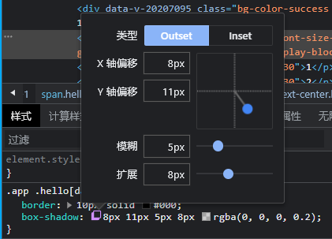

# 盒子阴影

CSS3 中新增了盒子阴影，我们可以使用 box-shadow 属性为盒子添加阴影。

```
box-shadow: h-shadow v-shadow blur spread color inset;
```

| 值        | 描述                     |
|----------|------------------------|
| h-shadow | 必需。水平阴影的位置，允许负值        |
| v-shadow | 必需。垂直阴影的位置，允许负值        |
| blur     | 可选。模糊距离。               |
| spread   | 可选，阴影的尺寸。              |
| color    | 可选，阴影的颜色。              |
| inset    | 可选，将外部阴影（outset）改为内部阴影 |

* 模糊距离：影子的虚实
* 阴影尺寸：影子的大小

`注意：`

1. 默认的是外阴影（outset），但是不可以在后面写这个单词，否则导致阴影无效
2. `盒子阴影不占用空间，不会影响其他盒子排列`

### 1、开发中阴影常用

原先盒子没有影子，当我们鼠标经过盒子就添加阴影效果

```
div:hover {
  box-shadow:10px 10px 10px -4px rgba(0,0,0,.3);     
}
```

> 可以在浏览器中拖动设置具体效果
> 

### 2、文字阴影

在 CSS3 中，我们可以使用 text-shadow 属性将阴影应用于文本。

```
text-shadow: h-shadow v-shadow blur color
```

| 值        | 描述              |
|----------|-----------------|
| h-shadow | 必需。水平阴影的位置，允许负值 |
| v-shadow | 必需。垂直阴影的位置，允许负值 |
| blur     | 可选。模糊距离         |
| color    | 可选，阴影的颜色。       |
