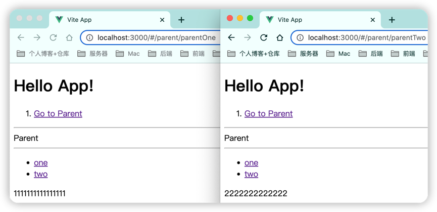

由多层嵌套的组件组成


`my-vue-router/src/router/index.js`

```js
import Parent from "../views/Parent.vue";
import ParentOne from "../views/ParentOne.vue";
import ParentTwo from "../views/ParentTwo.vue";

const routes = [
    {
        path: "/parent",
        component: Parent,
        children: [
            { path: "parentOne", component: ParentOne },
            { path: "parentTwo", component: ParentTwo },
        ],
    },
];
```

`my-vue-router/src/App.vue`

```vue
<template>
  <div>
    <h1>Hello App!</h1>
    <ol>
      <li><router-link to="/parent">Go to Parent</router-link></li>
    </ol>
    <hr />
    <router-view></router-view>
  </div>
</template>
```

`my-vue-router/src/views/Parent.vue`

```vue
<template>
  <div>user {{ $route.params.id }}</div>
</template>
<script setup>
import { useRoute } from "vue-router";
console.log(useRoute().params.id);
</script>
```

`my-vue-router/src/views/Parent.vue`

```vue
<template>
  <div>Parent</div>
  <hr />
  <div>
    <ul>
      <li>
        <router-link to="/parent/parentOne">one</router-link>
      </li>
      <li>
        <router-link to="/parent/parentTwo">two</router-link>
      </li>
    </ul>
    <router-view></router-view>
  </div>
</template>
```

`my-vue-router/src/views/ParentOne.vue`

```vue
<template>
  <div>1111111111111111</div>
</template>
```

`my-vue-router/src/views/ParentTwo.vue`

```vue
<template>
  <div>2222222222222</div>
</template>
```