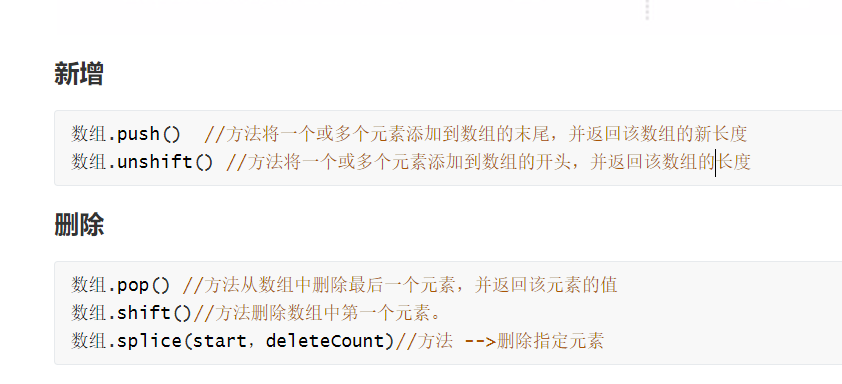

# js中字符串的常用函数
## charAt
**作用**：charAt() 是找到**字符串中指定索引位置的内容**返回
**语法**：字符串.charAt(索引)
**返回值**：该索引位置对应的字符
如果有该索引位置, 那么就是该索引位置的字符
如果没有该索引位置, 那么就是 空字符串('')
```js
var str = 'hello world'
// 使用 charAt 找到字符串中的某一个内容
var index = str.charAt(2)
console.log(index) // l

//查找索引为 13 的内容，因为没有返回是一共空字符串
var index1 = str.charAt(13)
console.log(index1); // ''
```
## charCodeAt
**作用**：charCodeAt() 就是**返回对应索引位置的 unicode 编码**
**语法**：字符串.charCodeAt(索引)
**返回值**：该索引位置的对应字符的 编码(十进制)
```js
var str = 'hello world'

// 使用 charAt 找到字符串中的某一个内容
var index = str.charCodeAt(4)
console.log(index) // 111
```
## indexOf
**作用**：indexOf 就是**按照字符找到对应的索引**
**语法**：字符串.indexOf(要查找的字符，开始索引)
**返回值**：
- 如果有该字符内容, 那么就是该字符的索引位置
- 如果没有该字符内容, 就是 -1

```js
var str = 'hello world'

// 使用 indexOf 找到字符串中的某一个内容
var index = str.indexOf('l', 0)
console.log(index) // 2 返回第一个找到的内容的下标后面的就不查找了

var index1 = str.indexOf('w', 3)
console.log(index1); // 6 不管从那个索引开始，索引的位置不变

var index2 = str.indexOf('w', 7)
console.log(index2); // -1 从索引7开始查找没有找到返回-1
```
## lastIndexOf
**作用**：lastIndexOf 是从**后向前检测该字符在字符串内的索引位置**
**语法**：字符串.indexOf(要查找的字符，开始索引)
**返回值**：
- 如果有该字符内容, 那么就是该字符的索引位置
- 如果没有该字符内容, 就是 -1
```js
var str = 'hello world'

// 使用 lastIndexOf 找到字符串中的某一个内容
var index = str.lastIndexOf('l')
console.log(index) //9 返回第一个找到的内容的下标后面的就不查找了,索引的位置不变

var index = str.lastIndexOf('l', 8)
console.log(index) //3 返回第一个找到的内容的下标后面的就不查找了，索引的位置不变

var index = str.lastIndexOf('w', 5)
console.log(index) //-1 从后开始查找，开始的索引是5 但是前面没有找到w 返回-1
```
## substring
**作用**：substring 是用来**截取字符串**使用的
**语法**： substring(从哪个索引开始，到哪个索引截止)，包含开始索引，不包含结束索引
**返回值**：返回截取到的内容
```js
var str = 'hello world'

// 使用 substring截取字符串中的某一个内容
var res = str.substring(2, 8)
console.log(res); //llo wo
```
## substr
**作用**：substr 也是用来**截取字符串**的
**语法**：substr(从哪个索引开始，截取多少个)
**返回值**：截取到的内容
```js
var str = 'hello world'

// 使用 substr截取字符串中的某一个内容
var res = str.substr(2, 7)//从索引2开始，截取7个
console.log(res); //llo wor
```
这个方法和 substring 不一样的是，**第二个参数是截取多少个**
## toLowerCase 和 toUpperCase
**作用**：这两个方法分别是用来给字母格式的字符串**转成 小写字母 和 大写字母** 的
**语法**：
- 字符串.toLowerCase()
- 字符串.toUpperCase()
```js
var str = 'hello world'

// 使用 toUpperCase 转换成大写
var upper = str.toUpperCase()
console.log(upper) // HELLO WORLD

// 使用 toLowerCase 转换成小写
var lower = upper.toLowerCase()
console.log(lower) // hello world
```
## slice
**作用**：**截取字符串**
**语法**：字符串.slice(起始索引，结束索引)
- 包含开始的索引对应的内容，不包含结束索引对应的内容
- 结束索引不写就直接截取到末尾

**返回值**：截取出来的字符串
```js
var str = 'hello world'

// 使用 slice 截取字符串
var res = str.slice(1, 4) //ell
console.log(res);
//没有结束的索引直接截取到末尾
var res1 = str.slice(1) //ello world
console.log(res1);
```
## replace
**作用**：用指定的内容**替换**掉字符串中的内容
**语法**：字符串.repalce(被替换的内容，要替换的内容)
- 被替换内容 => 换下内容
- 要替换内容 => 换上内容

**返回值**：替换好的字符串
**注意**：内容**只能被替换一次**，从索引0的位置开始
```js
var str = 'hello world'

// 使用 replace 替换字符串中的内容

var res = str.replace('l', 'M')

console.log(res); // heMlo world
console.log(str); // hello world
```
## split
**作用**：按照切割符号, **把字符串切割开, 放在一个数组里面**.
**语法**：字符串.split('指定的切割符')
- 切割符可以不传递，就会和整体当做一个字符串
- (''）空字符串会一位一位的切割
- (' ') 字符串中有空格 会按照原字符串中的空格切割

**返回值**：一个用指定切割符切割好的数组
```js
var str = 'hello world'

// 使用 split 切割成一个数组
var res = str.split()
console.log(res); //['hello world']

var res1 = str.split('')
console.log(res1); //['h', 'e', 'l', 'l', 'o', ' ', 'w', 'o', 'r', 'l', 'd']

var res2 = str.split(' ')
console.log(res2); //['hello', 'world']
```
## concat
**作用**：字符串拼接也可以说是**字符串合并**
**语法**：字符串.concat(字符串)
**返回值**：拼接后的字符串
```js
var str = 'hello world '

var str1 = 'ni hao'

// 使用 concat 切割成一个数组
var res = str.concat('ni hao')
console.log(res); // hello world ni hao

var res1 = str.concat(str1)
console.log(res1); // hello world ni hao
```
## trim
**作用**：**取出字符串头尾的空白内容**
**语法**：字符串.trim()
**返回值**：去除空白内容以后的字符串
```js
var str = '   hello world     '

// 使用 trim 切割成一个数组
var res = str.trim()
console.log(res); // hello world
```

## trimStart / trimLeft
**作用**：**去除字符串头部的空白内容**
**语法**：
- 字符串.trimStart()
- 字符串.trimLeft()
**返回值**：去除空白内容以后的字符串
```js
var str = '   hello world     '

// 使用 trimStart 后者trimLeft去除头部的空白内容
var res = str.trimStart()
console.log(res); //hello world 

var res1 = str.trimLeft()
console.log(res1); //hello world
```
## trimEnd / trimRight
**作用**：去除字符串尾部的空白内容
**语法**：
- 字符串.trimtrimEnd()
- 字符串.trimRight()
**返回值**：去除空白内容以后的字符串
```js
var str = '   hello world     '

// 使用 trimEnd 后者trimRight去除尾部的空白内容
var res = str.trimEnd()
console.log(res); //   hello world

var res1 = str.trimRight()
console.log(res1); //   hello world
```

## 数组的相关函数在字符串中的应用
可以先用split方法，将字符串根据什么分隔符进行分开，然后在用数组的相关方法进行操作


数组：filter()方法
这个方法主要用于**过滤**数组中的元素，并返回一个新数组。
```js
array.filter(function(value, index, arr), thisValue)
```
参数说明：

> function：函数，规定了过滤条件。必需。该函数接受三个参数：当前元素的值、当前元素的索引和包含该元素的数组。
>
> thisValue：可选项。对象作为该执行回调时使用，传递给函数，用作 “this” 的值。如果省略thisValue，则默认是全局对象（浏览器环境下是 window 对象）。

返回值：
返回一个新数组，其中包含符合条件的元素。

